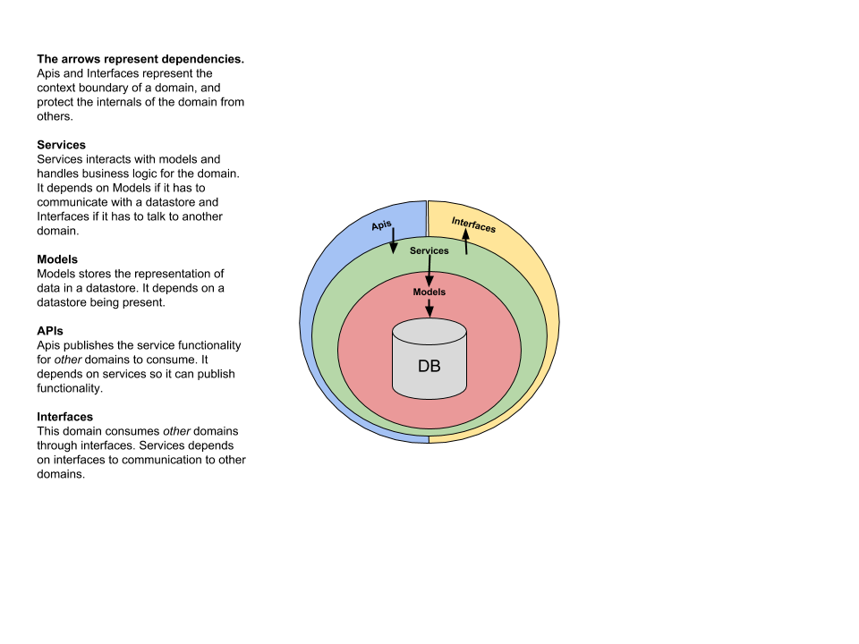
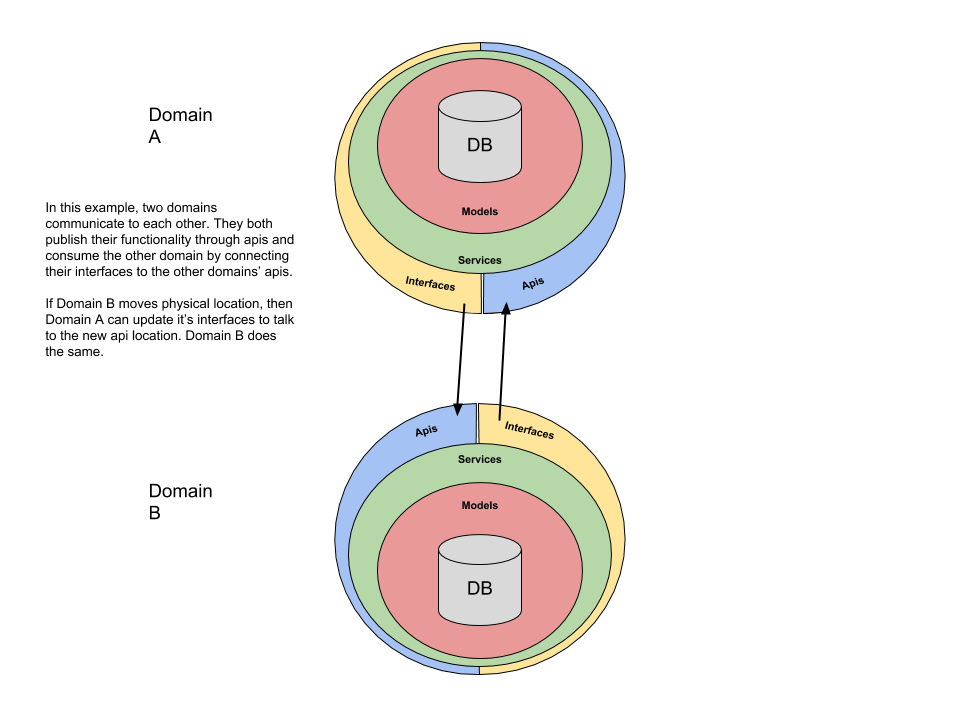

# Django API Domains styleguide

**Current version**: 1.0

| Version | Author(s)                                 | Date       |
| ------- |-------------------------------------------|------------|
| 1.0     | Paul Hallett  paulandrewhallett@gmail.com | 01-02-2019 |


**Table of contents:**

<!-- toc -->

- [Django API Domains styleguide](#django-api-domains-styleguide)
  - [Introduction](#introduction)
  - [Domains](#domains)
- [Styleguide](#styleguide)
  - [Visualisation](#visualisation)
  - [File structure](#file-structure)
- [Files in-depth](#files-in-depth)
  - [Models](#models)
  - [APIs](#apis)
  - [Interfaces](#interfaces)
  - [Services](#services)
- [In-depth examples](#in-depth-examples)
  - [Two domains](#two-domains)
- [Testing](#testing)
  - [Testing boundaries?](#testing-boundaries)
- [Appendix](#appendix)

<!-- tocstop -->

## Introduction

This styleguide combines [domain-driven design](https://en.wikipedia.org/wiki/Domain-driven_design) principles and Django's [apps](https://docs.djangoproject.com/en/dev/ref/applications/#module-django.apps) pattern to provide a **pragmatic** guide for developing scalable API services with the Django web framework.

This styleguide tries to tackle two big problems:

1) Design philosophies and design patterns work in "ideal" situations, and most real life problems do not represent this ideal world. Therefore we need to develop a flexible pattern that can adjust to support different situations.
2) The original design and documentation of Django is geared heavily towards server-side-rendered-view applications, yet most modern Django applications are built to serve APIs for a separate frontend application. Therefore, Django's patterns are outdated for today's trends.

In order to overcome these problems, this styleguide tries to achieve the following five goals:

1) Treat Django's `apps` more like software `domains`.
2) Extend Django's `apps` implementation to support strong [bounded context](https://www.martinfowler.com/bliki/BoundedContext.html) patterns between `domains`.
3) Enable separation of domains to happen when it makes sense for **increased development velocity**, not just for **business logic**.
4) Design a styleguide that reduces the effort involved in extracting the code for large domains into separate application servers.
5) Make sure the styleguide compliments API-based applications.

## Domains

A [domain](https://en.wikipedia.org/wiki/Domain_(software_engineering)) is considered a distinct _business problem_ within the context of your application.

Within the context of software, what this styleguide calls a `domain` is roughly an extension of what Django would call an "app". Therefore a _business_ domain **should** have at least one distinct _software_ domain mirroring it.

The examples below will talk about a business problem for a `book shop` that must share details about books. This can be modelled as a _domain_ called `books`, and as a _software domain_ also called `books`.

We keep the key benefits of Django's `app` pattern - namely Django's [models](https://docs.djangoproject.com/en/2.1/topics/db/models/) to represent tables in a datastore, with an emphasis on **skinny models**. We also retain Django's ability to *package apps as installable components in other applications*. This allows domains to be easily migrated to different codebases or completely different projects.

There are two high-level rules around domains:

1) You **should** split a domain if it becomes too big to work on. As a rule of thumb is that a domain should allow between 4-6 developers (3 pairs) to comfortably work on it. If you find your developers being blocked by each other then it is time to consider splitting the domain or checking the software has not diverged too far from the styleguide.

2) You **should** adhere to the styleguide patterns in this document in order to maintain strong bounded contexts between your domains. This applies even in situations where you extract one domain into two domains to increase velocity, but they still have to maintain a dependency between each other. We have found that if you relax the bounded context between domains, the boundary will erode and you will lose the ability to work on them independent of each other.

An example _software_ domain is provided in the same directory as this styleguide under `example_domain/`.

# Styleguide

## Visualisation



## File structure

A domain **must** use the following file structure:

```
apis.py - Public functions and access points.
interfaces.py - Integrations with other domains or external services.
models.py - Object models and storage.
services.py - Business and functional logic.
```

In addition, any existing files from a standard Django app are still allowed, such as `urls.py`, `apps.py` and `migrations/*`. `Views.py` in [Django's pattern](https://docs.djangoproject.com/en/dev/#the-view-layer) is **explicitly not allowed** in this styleguide pattern as we only focus on API-based applications. Most logic that used to live in Django's `views.py` would now be separated into `apis.py` and `services.py`.

* You **can** mask one of the required files as a directory for better file organisation. For example, you might want to split `apis.py` into this file structure:

```
apis/
  __init__.py
  rest.py
  graphql.py
```

Your `__init__.py` file in this directory can import the local files:

```python
# apis/__init__.py
from .rest import *  # noqa
from .graphql import *  # noqa
```

Then, any other file can then import from apis like so:

```python
# example.py
from domain.apis import Foo
```

This keeps namespaces tidy and does not leak domain details.

* A domain **does not** need to have all these files if it is not using them. For example - a domain that just co-ordinates API calls to other domains does not need to have `models.py` as it is probably not storing anything in a datastore.

* A domain **can have** additional files when it makes sense (such as `utils.py` or `enums.py` or `serializers.py`) to separate out parts of the code that aren't covered by the styleguide pattern.

<hr>

# Files in-depth

In the examples below we imagine a service with two domains - one for books, and one for authors. The abstraction between books and authors is only present to demonstrate the concepts in the styleguide. You could argue that Books and Authors can live in one domain. In our example **we also assume a book can only have one author.** It's a strange world.

## Models

Models defines how a data model/ database table looks. This is a Django convention that remains mostly unchanged. The key difference here is that you use _skinny models_ - no functional or business logic should live here. In the past Django has recommended an [active record](https://docs.djangoproject.com/en/2.1/misc/design-philosophies/#models) style for it's models. In practice, we have found that this encourages developers to make `models.py` bloated and do too much - often binding the presentation and business logic of a domain too tightly. This makes it very hard to have abstract presentations of the data in a domain. Putting all the logic in one place also makes it difficult to scale the number of developers working in this part of the codebase.

A models.py file can look like:

```python
import uuid
from django.db import models


class Book(models.Model):

    id = models.UUIDField(primar_key=True, default=uuid.uuid4)
    name = models.CharField(max_length=256)
    publisher = models.CharField(max_length=256)
    author_id = models.UUIDField(default=uuid.uuid4)

    @property
    def name_and_publisher(self):
        return f'{self.name}, {self.publisher}'

```

- Models **must not** have any complex business logic functions attached to them.
- Models **can** have computed properties where it makes sense.
- Models **must not** import services, interfaces, or apis from their own domain or other domains.
- Table dependencies (such as ForeignKeys) **must not** exist across domains. Use a UUID field instead, and have your `services.py` control the relationship between models. You **can** use ForeignKeys between tables in one domain. Be aware that this might hinder future refactoring.


## APIs

APIs defines the External API interface for your domain. Anyone using the APIs defined here is called a _consumer_. The API can be either an HTTP API using [graphQL](https://github.com/graphql-python) or [REST](https://www.django-rest-framework.org/) for consumers over the web, or a software API for internal consumers. APIs is defined in `apis.py` which is agnostic to the implementation you chose, and you can even put more than one API in a domain. For example - you might want to wrap a graphQL API _and_ a REST API around your domain for different consumers.

An apis.py file that defines a simple software API can look like:

```python
import logging
import uuid
from typing import Dict  # noqa

from .services import BookService

logger = logging.getLogger(__name__)


class BookAPI:

    @staticmethod
    def get(*, book_id: uuid.UUID) -> Dict:
        logger.info('method "get" called')
        return BookService.get_book(id=book_id)

```

- `Apis.py` **must be** used as the entry point for all other consumers who wish to use this domain.
- Internal APIs **should** just be functions.
- You **can** group interal API functions under a class if it makes sense for organisation.
- If you are using a class for your internal APIs, it **must** use the naming convention `MyDomainAPI`.
- Internal functions in apis.py **must** use type annotations.
- Internal functions in apis.py **must** use keyword arguments.
- You **should** log API call functions.
- All data returned from `apis.py` **must be** JSON serializable.
- `Apis.py` **must** talk to `services.py` to get data.
- It **must not** talk to `models.py` directly.
- It **must not** do any business logic.
- `Apis.py` **can** do simple business logic like transforming data for the outside world, or taking external data and transforming it for the domain to understand.
- Objects represented through the API **do not** have to map directly to internal database representations of data.


## Interfaces

Your domain may need to communicate with another domain. That domain can be in another web server across the web, or it could be within the same server. It could even be a third-party service. When your domain needs to talk to other domains, you should define **all interactions with it in the interfaces.py file**. Combined with `apis.py` (see above), this forms the bounded context of the domain, and prevents business logic leaking in.

Consider interfaces.py like a mini _Anti-Corruption Layer_. Most of the time it won't change and it'll just pass on arguments to an API function. But when the other domain moves - say you extract it into it's own web service, your domain only needs to update the `interfaces.py` to reflect the change. No complex refactoring needed, woohoo!

An interfaces.py may look like:

```python
import uuid
from typing import Dict, Str  # noqa

# Could be an internal domain or an HTTP API client - we don't care!
from src.authors.apis import AuthorAPI


# plain example
def update_author_name(*, author_name: Str, author_id: uuid.UUID) -> None:
    AuthorAPI.update_author_name(
        id=author_id,
        name=author_name,
    )


# class example
class AuthorInterface:

    @staticmethod
    def get_author(*, id: uuid.UUID) -> Dict:
        return AuthorAPI.get(id=id)

    @staticmethod
    def update_author_name(
      *,
      author_name: Str,
      author_id: uuid.UUID,
    ) -> None:
        AuthorAPI.update_author_name(
            id=author_id,
            name=author_name,
        )

```

- The primary components of interfaces.py **should** be functions.
- You **can** group functions under a class if it makes sense for organisation.
- If you are using a class, it **must** use the naming convention `MyDomainInterface`.
- Functions in interfaces.py **must** use type annotations.
- Functions in interfaces.py **must** use keyword arguments.

## Services

Everything in a domain comes together in `services.py`.

Services defines all the business-problem logic that might be needed for this domain. What is considered a bussiness-problem? Here are a few examples:

- When creating a new instance of a model, we need to compute a field on it before saving.
- When querying some content, we need to collect it from a few different places and gather it together in a python object.
- When deleting an instance we need to send a signal to another domain so it can do it's own logic.

Anything that is specific to the domain problem should live in `services.py`. As most API projects expose single functional actions such as Create, Read, Update, and Delete, `services.py` has been designed specifically to compliment stateless, single-action functions.

A services.py file could look like:

```python
import logging
import uuid
from typing import Dict, Str  # noqa

from .interfaces import AuthorInterface
from .models import Book

logger = logging.getLogger(__name__)


# Plain example
def get_book(*, id: uuid.UUID) -> Book:
    book = Book.objects.get(id=id)
    author = AuthorInterface.get_author(id=book.author_id)
    return {
        'name': book.name,
        'author_name': author.name,
    }


# Class example
class PGMNodeService:

    @staticmethod
    def get_book(*, id: uuid.UUID) -> Dict:
        book = Book.objects.get(id=id)
        author = AuthorInterface.get_author(id=book.author_id)
        return {
            'name': book.name,
            'author_name': author.name,
        }

    @staticmethod
    def create_book(*, name: Str, author_id: uuid.UUID) -> Dict:
        logger.info('Creating new book')
        new_book = Book.objects.create(name=name, author_id=author_id)
        author = AuthorInterface.get_author(id=new_book.author_id)
        return {
            'name': new_book.name,
            'author_name': author.name,
        }

    @staticmethod
    def update_book_name_and_author_name(
        *,
        name: Str,
        author_name: Str,
        author_id: uuid.UUID,
        id: uuid.UUID,
    ) -> Dict:
        logger.info('Updating book name and author name')
        book = Book.objects.get(id=id).update(name=name)
        author = AuthorInterface.update_author_name(
            name=author_name, id=author_id,
        )
        return {
            'name': book.name,
            'author_name': author.name,
        }

```

- The primary components of `services.py` **should** be functions.
- You **can** group functions under a class if it makes sense for organisation.
- If you are using a class, it **must** use the naming convention `MyDomainService`.
- Functions in services.py **must** use type annotations.
- Functions in services.py **must** use keyword arguments.
- You **should** be logging in services.py.

# In-depth examples

## Two domains

Let's start with a basic example - a project that has two domains. They both expose APIs for a Frontend service, and they also communicate to each other.
Communicating to the Frontend service is simple - they have defined a REST API in their API layer and the Frontend calls it.

When talking to each other, they both _interface_ (hence the naming choice) with each other through the appropriate layers. Sometimes we call the this "API to interface path".

Let's imagine that the owners of Domain B decide they want to move their software into another web server on the other side of the world. The first thing they might do is make a copy of the software of Domain B. They might spin up that copy in the new world, and slowly port the data over from the old Domain B.

During this time, Domain A is still talking to the old Domain B. When the new Domain B is ready to go, they inform the team that owns Domain A. The Domain A team will then update their interfaces.py to point to the new Domain B instance. Because they have not leaked Domain B's logic throughout Domain A, the change is isolated to a single file (and hopefully a single git commit).



# Testing

The testing file structure for a domain should be identical to the files in the domain itself.

For example - `test_models.py` should be used for testing `models.py`.

What levels of testing should be done in each file? It depends on the context. `test_models.py` is testing the `models.py` file, which only cares about database definitions. Whereas `test_services.py` could be testing that `services.py`, `interfaces.py` and `models.py` work together properly.

## Testing boundaries?

The only place in your code that touches the outside world (anything outside your domain - other domains, or external consumers) is `interfaces.py`. Any file that handles `interfaces.py` should **mock out other dependent domains** but you should still be testing your **own interface definitions**.

You should use Python's [standard `patch` tool for this](https://docs.python.org/3.5/library/unittest.mock.html#unittest.mock.patch).

You **can** use [`MagicMock`](https://docs.python.org/3.5/library/unittest.mock.html#unittest.mock.MagicMock) where it makes sense.

Here is an example:

```python
# book/test_services.py
from unittest.mock import patch

from src.book.services import create_book


@patch('src.book.interfaces.AuthorInterface.get_author')
def test_service_calls_author_interface(mocked_function_call):
    # Set up patched domain calls if you need it
    mocked_function_call.return_value = {
        'returned': 'object',
    }
    # The actual test
    result = create_book(
        name='A Wizard of Earthsea',
        author_id='d29eee0b-5b60-46d8-8c42-a8da9ddabbb6',
    )
    # Assert patched domain called with expected values
    assert mocked_function_call.assert_called_with(
      id='d29eee0b-5b60-46d8-8c42-a8da9ddabbb6',
    )
```


# Appendix

This document's use of **CAN**, **SHOULD** and **MUST** are based on RFC 2119: https://www.ietf.org/rfc/rfc2119.txt

This styleguide is heavily inspired by:

* Django's own documentation and recommendations: https://docs.djangoproject.com/en/dev/
* The HackSoftware Django-styleguide: https://github.com/HackSoftware/Django-Styleguide
* Model-driven engineering: https://en.wikipedia.org/wiki/Model-driven_engineering