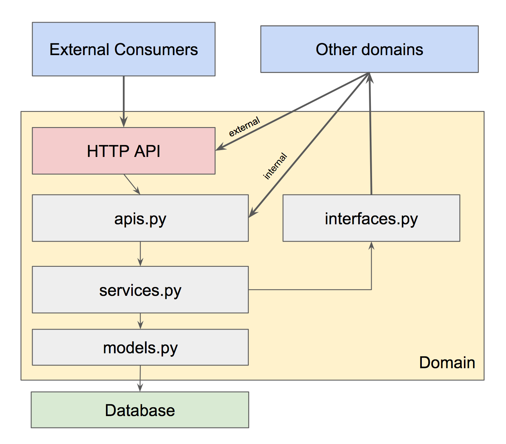

# Domain Styleguide

**Current version**: 1.1

| Version | Author(s)                              | Date       |
| ------- |----------------------------------------|------------|
| 1.0     | Paul Hallett                           | 17-12-2018 |
| 1.1     | Paul Hallett, Emre Kartoglu, Jess Mann | 20-12-2018 |

### Living Document

This is a living document. It could change. The rules here are intended to create a good separation of concerns between domains and provide portability and maintainability by standardising software patterns. Consider this when making changes to _this_ document - never let changes reduce portability or maintainability.

## Domains...?

This document outlines how a domain service should be structured.

A domain is considered a distinct _business problem_ within the context of AI data & content management.
We prefer the concern of a domain to make sense from a data & content perspective and not necessarily linked to a single _consumer application_.

You **can** create a domain that encapsulates the concerns required for a whole _consumer application_ and talks to the other domain components it needs to fulfil it's job.

You **can** split a domain if it becomes too big to work on. A rule of thumb is - a domain should allow between 4-6 developers to comfortably work on it without constantly causing merge conflicts or overwriting code.

Some example domains you could find in this code:

* **Core PGM** - Code that solves the business problem of moderating nodes and their relationships with a graph.
* **Medical Concepts** - Code that solves the business problem of moderating Medical Concepts.
* **Question Asking Mechanisms** - Code that solves the business problems of moderating Questions, Answers, and flows.
* **Sickcare** - Code that solves the consumer application problem for the Sickcare / Symptom Checker feature.
* **Condition Management** - Code that solves the consumer application problem for the Condition Management feature.

An example domain is provided in the same directory as this document.

## Domains and Django

We have chosen Django as our web framework of choice. With this in mind, what we call a domain roughly maps to what Django would call an "app". You can read more about Django apps here: https://docs.djangoproject.com/en/2.1/ref/applications/


## File structure

### Visualisation



A domain **should** use the following file structure:

```
migrations/
apps.py
admin.py
apis.py
interfaces.py
models.py
services.py
```

A domain **does not** need to have all these files if it is not using them. For example - a domain that just just co-ordinates other domains does not need to have `models.py` as it does not store anything.

A domain **can have** additional files when it makes sense (such as `utils.py` or `enums.py`) to separate out parts of the code.

## Examples

In the examples below we imagine a service with two domains - one for books, and one for authors. The abstraction between books and authors is only present to demonstrate concepts in the styleguide.

**We assume a book can only have one author.** Don't be pedantic 😉

### migrations/

This directory is a Django convention where all database schema migrations will live. This remains the same in our styleguide. A developer **should not** have to touch this directory unless doing manual migration creation. See the [django docs](https://docs.djangoproject.com/en/2.1/howto/writing-migrations/) for more information.

### apps.py

Apps.py contains the Django configuration for app. It is a Django convention that remains unchanged.

An apps.py may look like:

```python
from django.apps import AppConfig


class BooksConfig(AppConfig):
    name = 'books'

```

### admin.py

Admin.py contains the logic for displaying entities in the Django admin web view. It is a Django convention that remains unchanged.

An admin.py may look like:

```python
from django.contrib import admin

from .models import Book

admin.site.register(Book)

```

- You **should** use admin.py if you want to moderate data through the default admin view.

### interfaces.py

A domain may need to communicate with another domain in the system. When your domain needs to do this, you should define **all interactions with other domains in the interfaces.py file**.

This is sometimes a different mindset to that of a normal developers mindset. If Domain A cares about Domain B - Domain A defines it's interface to talk to Domain B. It is not the job of Domain B to provide the correct interface to Domain A. This is similar to the _inversion of control_ pattern.

When Domain B is moved (say, to a separate service over HTTP instead of software APIs) - just the interfaces.py in Domain A has to change.

Consider interfaces.py like a mini _Anti-Corruption Layer_ but within your own domain. Most of the time it won't change much, but when you need to represent different views of data from other services it will become incredibly useful.

- The primary components of interfaces.py **should** be functions.
- You **can** group functions under a class if it makes sense for the business domain.
- If you are using a class, it **must** use the naming convention `MyDomainInterface`.
- Functions in interfaces.py **must** use type annotations.
- Functions in interfaces.py **must** use keyword arguments.

An interfaces.py may look like:

```python
import uuid
from typing import Dict, Str  # noqa

# Could be an internal domain or an HTTP API client - we don't care!
from src.authors.apis import AuthorAPI


# plain example
def update_author_name(*, author_name: Str, author_id: uuid.UUID) -> None:
    AuthorAPI.update_author_name(
        id=author_id,
        name=author_name,
    )


# class example
class AuthorInterface:

    @staticmethod
    def get_author(*, id: uuid.UUID) -> Dict:
        return AuthorAPI.get(id=id)

    @staticmethod
    def update_author_name(
      *,
      author_name: Str,
      author_id: uuid.UUID,
    ) -> None:
        AuthorAPI.update_author_name(
            id=author_id,
            name=author_name,
        )

```

### models.py

Models.py defines how a data model / database table looks and acts. This is a Django convention that remains unchanged.

A models.py may look like:

```python
import uuid
from django.db import models


class Book(models.Model):

    id = models.UUIDField(primar_key=True, default=uuid.uuid4)
    name = models.BooleanField(default=False)
    author_id = models.UUIDField(default=uuid.uuid4)

```

- Table dependencies (such as ForeignKeys) **must not** exist across domains. Use a UUID or ID field instead, and have your `services.py` control the relationship between models.
- You **can** use ForeignKeys between tables in one domain.

See `services.py` below for examples of how to handle relationships across domains.

### apis.py

Apis.py defines the External API interface for your domain.
This can be either an HTTP type API like [graphQL mutations](https://graphql.org/learn/queries/#mutations) and [graphQL queries](https://graphql.org/learn/queries/) for external consumers, or a software API for internal domains to call. In the AI CMS platform we regularly interface with graph-like data so graphQL APIs are the primary interface for external consumers.

Entities do not have to be a direct mapping to a database model defined in `models.py` - they can be a compound entity made of many models or computed values.

An apis.py file could look like:

```python
import logging
import uuid
from typing import Dict  # noqa

import graphene
from graphene import ObjectType, relay

from .services import BookService

logger = logging.getLogger(__name__)


# Internal API
class BookAPI:

    @staticmethod
    def get(*, book_id: uuid.UUID) -> Dict:
        logger.info('method "get" called')
        return BookService.get_book(id=book_id)


# graphQL Entity
class BookEntity(ObjectType):
    class Meta:
        interfaces = (relay.Node,)
    name = graphene.String()
    author_name = graphene.String()


# graphQL mutation
class CreateBook(relay.ClientIDMutation):
    class Input:
        book_name = graphene.String(required=True)
        author_id = graphene.ID(required=True)

    book = graphene.Field(BookEntity)

    @classmethod
    def mutate_and_get_payload(cls, root, info, **input):
        new_book = BookService.create_book(
            name=input.get('book_name'),
            author_id=input.get('author_id')
        )
        return BookEntity(
            name=new_book['name'],
            author_name=new_book['author_name'],
        )


# graphQL mutation
class UpdateBookAndAuthorName(relay.ClientIDMutation):
    class Input:
        book_name = graphene.String(required=True)
        author_name = graphene.String(required=True)
        author_id = graphene.ID(required=True)
        book_id = graphene.ID(required=True)

    book = graphene.Field(BookEntity)

    @classmethod
    def mutate_and_get_payload(cls, root, info, **input):
        book = BookService.update_book_name_and_author_name(
            name=input.get('book_name'),
            id=input.get('book_id'),
            author_id=input.get('author_id'),
            author_name=input.get('author_name'),
        )
        return BookEntity(
            name=book['name'],
            author_name=book['author_name'],
        )


class Mutation:
    create_book = CreateBook.Field()


class Query:
    book = graphene.Field(BookEntity)

    def resolve_book(self, info):
        logger.info(f"graphQL query for book with id {info.get('id')}")
        book = BookService.get_book(id=info.get('id'))
        return BookEntity(
            name=book['name'],
            author_name=book['author_name'],
        )

```

- `Apis.py` **must be** used as the entry point for all other domains and consumers. An external service is a domain that is not present in the same app server and enters this domain over HTTP.
- Internal APIs must be defined here for other internal domains to communicate with your domain.
- All data returned from `apis.py` **must be** JSON serialisable.
- `Apis.py` **must** talk to `services.py` to get data. It **must not** talk to `models.py` directly.
- Entities represented through the API **do not** have to map directly to internal database representations of data.
- Internal functions in apis.py **must** use type annotations.
- Internal functions in apis.py **must** use keyword arguments.
- You **should** log API calls.

### services.py

Everything in a domain comes together in `services.py`.

`Services.py` defines all the business-problem logic that might be needed for this domain. What is considered a bussiness-problem? Here are a few examples:

- When creating a new instance of a model, we need to compute a field on it before saving.
- When querying some content, we need to collect it from a few different places and gather it together in a python object.
- When deleting an instance we need to send a signal to another domain so it can do it's own logic.

Anything that is specific to the domain problem, such as the examples above, should live in `services.py`.

Because `services.py` is responsible for handling most of the logic within a domain, there are some rules:

- The primary components of `services.py` **should** be functions.
- You **can** group functions under a class if it makes sense from the business domain.
- If you are using a class, it **must** use the naming convention `MyDomainService`.
- Functions in services.py **must** use type annotations.
- Functions in services.py **must** use keyword arguments.
- You **should** be logging in services.py.

A services.py file could look like:

```python
import logging
import uuid
from typing import Dict, Str  # noqa

from .interfaces import AuthorInterface
from .models import Book

logger = logging.getLogger(__name__)


# Plain example
def get_book(*, id: uuid.UUID) -> Book:
    book = Book.objects.get(id=id)
    author = AuthorInterface.get_author(id=book.author_id)
    return {
        'name': book.name,
        'author_name': author.name,
    }


# Class example
class PGMNodeService:

    @staticmethod
    def get_book(*, id: uuid.UUID) -> Dict:
        book = Book.objects.get(id=id)
        author = AuthorInterface.get_author(id=book.author_id)
        return {
            'name': book.name,
            'author_name': author.name,
        }

    @staticmethod
    def create_book(*, name: Str, author_id: uuid.UUID) -> Dict:
        logger.info('Creating new book')
        new_book = Book.objects.create(name=name, author_id=author_id)
        author = AuthorInterface.get_author(id=new_book.author_id)
        return {
            'name': new_book.name,
            'author_name': author.name,
        }

    @staticmethod
    def update_book_name_and_author_name(
        *,
        name: Str,
        author_name: Str,
        author_id: uuid.UUID,
        id: uuid.UUID,
    ) -> Dict:
        logger.info('Updating book name and author name')
        book = Book.objects.get(id=id).update(name=name)
        author = AuthorInterface.update_author_name(
            name=author_name, id=author_id,
        )
        return {
            'name': book.name,
            'author_name': author.name,
        }

```

## Testing

The testing file structure for a domain should be identical to the files in the domain itself.

For example - `test_models.py` should be used for testing `models.py`.

What levels of testing should be done in each file? It depends on the context. `test_models.py` is testing the `models.py` file, which only cares about database definitions. Whereas `test_services.py` could be testing that `services.py`, `interfaces.py` and `models.py` work together properly.

### Testing boundaries?

The only place in your code that touches the outside world (anything outside your domain - other domains, or external consumers) is `interfaces.py`. Any file that handles `interfaces.py` should **mock out other dependent domains** but you should still be testing your **own interface definitions**.

You should use Python's [standard `patch` tool for this](https://docs.python.org/3.5/library/unittest.mock.html#unittest.mock.patch).

You **can** use [`MagicMock`](https://docs.python.org/3.5/library/unittest.mock.html#unittest.mock.MagicMock) where it makes sense.

Here is an example:

```python
# book/test_services.py
from unittest.mock import patch

from src.book.services import create_book


@patch('src.book.interfaces.AuthorInterface.get_author')
def test_service_calls_author_interface(mocked_function_call):
    # Set up patched domain calls if you need it
    mocked_function_call.return_value = {
        'returned': 'object',
    }
    # The actual test
    result = create_book(
        name='A Wizard of Earthsea',
        author_id='d29eee0b-5b60-46d8-8c42-a8da9ddabbb6',
    )
    # Assert patched domain called with expected values
    assert mocked_function_call.assert_called_with(
      id='d29eee0b-5b60-46d8-8c42-a8da9ddabbb6',
    )
```
